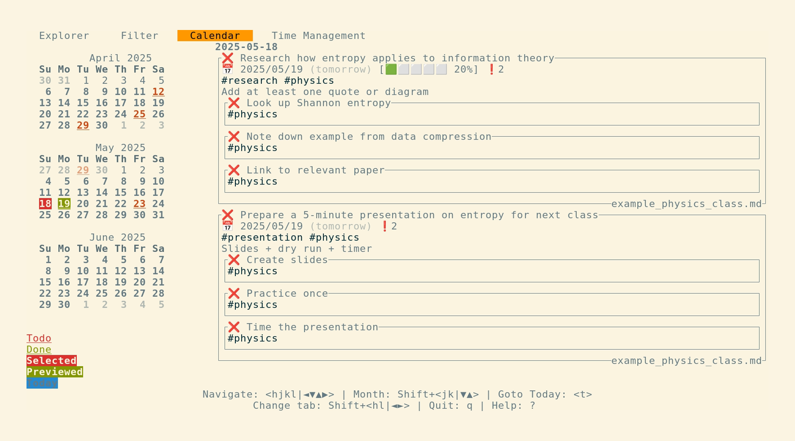
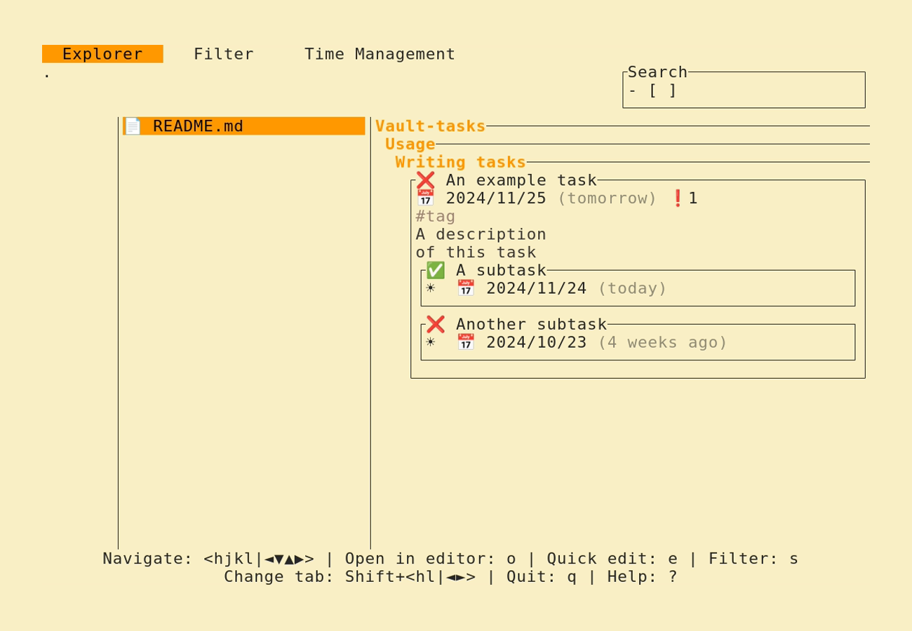
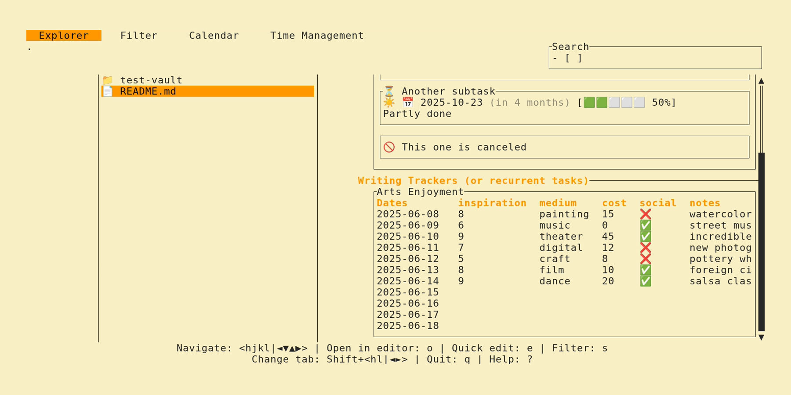

# Vault-tasks

A **Terminal User Interface (TUI) Markdown task manager** that parses any Markdown file or vault to display and manage your tasks seamlessly.


## Table of Contents

- [Why Vault-tasks?](#why-vault-tasks)
- [Key Features](#key-features)
- [Quick Start](#quick-start)
- [Installation](#installation)
- [Task Syntax](#task-syntax)
- [Trackers (Recurring Tasks)](#trackers-recurring-tasks)
- [Navigation & Controls](#navigation--controls)
- [Usage Modes](#usage-modes)
- [Configuration](#configuration)
- [Contributing](#contributing)

## Why Vault-tasks?

**Integrate tasks directly into your Second Brain.** Markdown tasks are easy to integrate with knowledge/projects, source-control-friendly, and work perfectly in terminal-based workflows.

Perfect for users who:

- ✅ Work primarily in terminal environments (Vim, Helix, etc.)
- ✅ Want lightweight, fast task management
- ✅ Prefer Markdown-based workflows
- ✅ Need tasks integrated with their knowledge base

> 📖 Read more about the workflow in this [blog post](https://blog.louis-thevenet.fr/posts/personal-knowledge-management-and-tasks/)

## Key Features

| Feature                  | Description                                                        |
| ------------------------ | ------------------------------------------------------------------ |
| 📝 **Smart Task Parser** | Subtasks, relative dates, tags, priorities, completion percentages |
| 🔄 **Trackers**          | Recurring tasks with customizable frequencies                      |
| 🗂️ **Vault Navigation**  | Browse and edit tasks across your entire vault                     |
| 🔍 **Search & Filter**   | Advanced sorting and filtering capabilities                        |
| 📅 **Calendar View**     | Visual timeline of your tasks                                      |
| ⏱️ **Time Management**   | Built-in Pomodoro & Flowtime techniques                            |



## Quick Start

```bash
# Install via cargo
cargo install vault-tasks

# Run
vault-tasks -v /path/to/your/vault
```

## Installation

### Cargo

```bash
cargo install vault-tasks
```

### Nix (nixpkgs 24.11+)

```nix
vault-tasks = {
  url = "github:louis-thevenet/vault-tasks";
  inputs.nixpkgs.follows = "nixpkgs";
};
```

### Build from Source

```bash
git clone https://github.com/louis-thevenet/vault-tasks.git
cd vault-tasks
cargo build --release
```

## Task Syntax

### Basic Task Format

```markdown
- [ ] Task title #tag tomorrow p1
      Task description
      can span multiple lines
  - [x] Completed subtask today @today
  - [/] Partial subtask c50
  - [-] Canceled subtask
```

### Tokens Reference

| Token         | Example                     | Description                             |
| ------------- | --------------------------- | --------------------------------------- |
| **States**    | `[ ]` `[x]` `[/]` `[-]`     | To-Do, Done, Incomplete, Canceled       |
| **Priority**  | `p1` `p5` `p10`             | Task priority (higher = more important) |
| **Progress**  | `c50` `c75`                 | Completion percentage                   |
| **Tags**      | `#work` `#urgent`           | Regular tags for organization           |
| **Today Tag** | `@today` `@tod` `@t`        | Mark for today (shows ☀️)               |
| **Dates**     | `23/10` `2024/10/23`        | Literal due dates                       |
| **Relative**  | `today` `tomorrow` `monday` | Dynamic dates                           |
| **Duration**  | `3d` `2w` `1m` `1y`         | "In X days/weeks/months/years"          |

### Example Output



## Trackers (Recurring Tasks)

Track habits and recurring activities with customizable data columns:

```markdown
Tracker: Workout Routine (today)

| Every day  | duration | type    | intensity | notes         |
| ---------- | -------- | ------- | --------- | ------------- |
| 2025-06-15 | 45       | cardio  | 7         | great session |
| 2025-06-16 | 30       | weights | 8         | did squats    |
| 2025-06-17 |          |         |           |               |
```

### Supported Frequencies

- `Every <hour|day|week|month|year>`
- `hourly`, `daily`, `weekly`, `monthly`, `yearly`

### Data Types

- **Boolean**: `[ ]` or `[x]`
- **Score**: Any integer (1-10, etc.)
- **Note**: Any text
- **Blank**: Empty cell

(Every entry in a column must have the same type)



## Navigation & Controls

### Quick Reference

| Action       | Keys                       | Description                            |
| ------------ | -------------------------- | -------------------------------------- |
| **Tabs**     | `Shift+H/L` or `Shift+←/→` | Switch between tabs                    |
| **Navigate** | `hjkl` or arrow keys       | Move around                            |
| **Search**   | `s`                        | Focus search bar                       |
| **Edit**     | `e`                        | Quick edit, `o` for default editor     |
| **States**   | `t/d/i/c`                  | Mark as To-Do/Done/Incomplete/Canceled |
| **Help**     | `?`                        | Show keybindings for current tab       |
| **Quit**     | `q` or `Ctrl+C`            | Exit application                       |

> Press `?` in any tab for complete keybinding reference

## Usage Modes

### Interactive Modes

```bash
vault-tasks explorer  # Default: browse vault structure
vault-tasks filter    # Search and filter tasks
vault-tasks calendar  # Calendar view of tasks
vault-tasks time      # Time management tools
```

### Output Mode

```bash
vault-tasks stdout    # Print tasks to terminal
```

## Configuration

Generate default config:

```bash
vault-tasks generate-config
```

Customize at `$HOME/.config/vault-tasks/config.toml`:

- Default vault path
- Custom keybindings
- Color schemes
- Behavior settings

## Contributing

Contributions welcome! Feel free to:

- 🐛 Submit bug reports
- 💡 Request features
- 🔧 Submit pull requests
- 📚 Improve documentation

---

**[⭐ Star on GitHub](https://github.com/louis-thevenet/vault-tasks)** • **[📖 Full Documentation](https://github.com/louis-thevenet/vault-tasks/wiki)** • **[🐛 Report Issues](https://github.com/louis-thevenet/vault-tasks/issues)**
