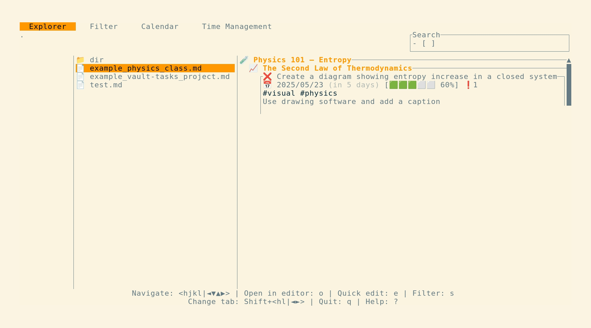

# Vault-tasks

`vault-tasks` is a TUI Markdown task manager.

It will parse any Markdown file or vault and display the tasks it contains.


## Why

I made this tool because I wanted to integrate my task system directly inside my Second Brain.

Markdown tasks are very easy to integrate with knowledge and projects.

I also spend most of my writing time in the terminal (Helix) and do not rely on heavy external software.

## Features

- Task Parser (see [Usage](https://github.com/louis-thevenet/vault-tasks/tree/main?tab=readme-ov-file#usage))
  - Subtasks
  - Fixed and relative dates
  - special _today_ tag and regular tags
  - descriptions
  - priority
- Navigate vault
- Search through tasks (sort and filter)
- Edit tasks or open in default editor
- Time Management tab (Pomodoro & Flowtime)

## Planned Features

- `new` action in Explorer Tab to create a new child on selected entry
- A Timeline tab with a calendar and a chronological view. (I'd also like to be able to import calendar files)

## Installation

### Cargo

```
cargo install vault-tasks
```

### Nix

It will be added to nixpkgs when I have time to make a nix module. For now, add the repo to your inputs:

```nix
vault-tasks = {
  url = "github:louis-thevenet/vault-tasks";
  inputs.nixpkgs.follows = "nixpkgs";
};
```

And use the package in your configuration: `inputs.vault-tasks.packages.${pkgs.system}.default`

### Build From Source

```
git clone https://github.com/louis-thevenet/vault-tasks.git
cd vault-tasks
cargo build --release
```

## Usage

See `vault-tasks --help` for basic usage.

### Writing tasks

```md
<!-- An example task in your markdown file -->

- [ ] An example task #tag tomorrow p1
      A description
      of this task
  - [x] A subtask today @today
  - [/] Another subtask 10/23 @today
    Partly done
  - [-] This one is canceled
```

| Token                                      | Meaning                                                           |
| ------------------------------------------ | ----------------------------------------------------------------- |
| `- [ ]` (`- [x]`, ...)                     | declares a task and sets its state                                |
| `p1` (`p10`, ...)                          | sets the priority                                                 |
| `#tag`                                     | is a tag, a task can have zero or more tags                       |
| `@today` (`@tod`, `@t`)                    | is a special tag that will mark the task as part of today's tasks |
| `23/10` (`2024/23/10`)                     | sets the due date with a literal date                             |
| `today` (`tdy`)                            | sets the due date to today                                        |
| `tomorrow` (`tmr`)                         | sets the due date to tomorrow                                     |
| a day of the week (`monday` or `mon`, etc) | sets the due date to the next occurence of that day               |
| `3d` (`3m, 3w, 3y`, ...)                   | means "in 3 days" and will set the due date accordingly           |

- Task states are **Done** (`x`), **To-Do** (` `), **Incomplete** (`/`) and **Canceled** (`-`)

- `@today` allows you mark a task for today while keeping a due date. It will show up with a ☀️ in `vault-tasks`.

- Relative dates are always replaced by literal dates once `vault-tasks` is run. Thanks to this, `vault-tasks` does not store any data except its config file.

- Other tokens will be part of the title of that task

- Descriptions and subtasks are declared using indents (see [[README#Configuration]])

This is what you will see in the preview of this `README.md` in `vault-tasks`:


<!-- Or when filtering for `@today` tasks: -->
<!--  -->

### Default Key Map

Check the key map within the app with `?`

#### General

| Key         | Alternate Key | Action                                    |
| ----------- | ------------- | ----------------------------------------- |
| `shift-h`   | `shift-←`     | Previous tab                              |
| `shift-l`   | `shift-→`     | Next tab                                  |
| `ctrl-k`    | `ctrl-↓`      | Scroll up                                 |
| `ctrl-j`    | `ctrl-↑`      | Scroll down                               |
| `page_down` |               | Scroll one page down                      |
| `page_up`   |               | Scroll one page up                        |
| `q`         | `ctrl-c`      | Quit the application                      |
| `?`         |               | Open keybindings menu for the current tab |

#### Explorer Tab

##### Navigation

| Key | Alternate Key     | Action              |
| --- | ----------------- | ------------------- |
| `k` | `↑`, `shift-tab`  | Previous entry      |
| `j` | `↓`, `tab`        | Next entry          |
| `h` | `←`, `back_space` | Leave current entry |
| `l` | `→`,`enter`       | Enter current entry |

##### Commands

| Key | Action                                         |
| --- | ---------------------------------------------- |
| `s` | Focus search bar (`enter` or `esc` to unfocus) |
| `o` | Open selection in default editor               |
| `e` | Quickly edit selection                         |
| `r` | Reload vault                                   |
| `t` | Mark task **To-Do**                            |
| `d` | Mark task **Done**                             |
| `i` | Mark task **Incomplete**                       |
| `c` | Mark task **Canceled**                         |



#### Filter Tab

##### Commands

| Key       | Action                   |
| --------- | ------------------------ |
| `enter`   | Focus/Unfocus search bar |
| `Shift-s` | Change sorting mode      |


#### Time Management Tab

##### Navigation

| Key | Alternate Key | Action           |
| --- | ------------- | ---------------- |
| `k` | `↑`           | Previous setting |
| `j` | `↓`           | Next setting     |

##### Commands

| Key         | Action                             |
| ----------- | ---------------------------------- |
| `space`     | Next segment (skip current)        |
| `p`         | Pause timer                        |
| `e`         | Edit selected setting              |
| `shift-tab` | Previous time management technique |
| `tab`       | Next time management technique     |


### Modes

You can start already focused on a tab by using one of the CLI subcommands:

```bash
vault-tasks explorer # is the default
# Or
vault-tasks filter
vault-tasks time
```

You can also output the content of a vault in standard output using

```bash
vault-tasks stdout
```

Example output:

```
vault-tasks -v ./README.md stdout
./README.md
‾‾‾‾‾‾‾‾‾‾‾
        README.md
        ‾‾‾‾‾‾‾‾‾
                Vault-tasks
                ‾‾‾‾‾‾‾‾‾‾‾
                        Usage
                        ‾‾‾‾‾
                                Writing tasks
                                ‾‾‾‾‾‾‾‾‾‾‾‾‾
                                        ❌ An example task
                                        📅 2024-12-22 (tomorrow)❗1
                                        #tag
                                        A description
                                        of this task

                                                ✅ A subtask
                                                ☀️ 📅 2024-12-21 (today)


                                                ⏳ Another subtask
                                                ☀️ 📅 2024-10-23 (2 months ago)
                                                Partly done


                                                🚫 This one is canceled


```

## Configuration

The [`config.toml`](./.config/config.toml) contains the default configuration which can be generated using `vault-tasks generate-config`.

In `$HOME/.config/vault-tasks/config.toml`, you can override the default settings, keybindings and colorscheme.

In particular, you can set a default vault path.

## Contributing

Feel free to submit issues or pull requests. Contributions are welcome!
